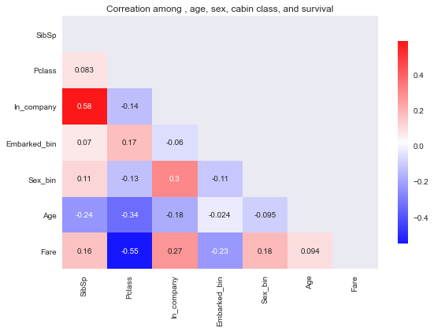

# Regression on the Titanic dataset

- [Link to dataset](https://www.kaggle.com/c/titanic/data)


```python
path= "./data/"
csv_train= "train.csv"
csv_test= "test.csv"
import pandas as pd 
train= pd.read_csv(path+csv_train)
test= pd.read_csv(path+csv_test)
data= train.copy()
```

## EDA


```python
data.columns
```


    Index(['PassengerId', 'Survived', 'Pclass', 'Name', 'Sex', 'Age', 'SibSp',
           'Parch', 'Ticket', 'Fare', 'Cabin', 'Embarked'],
          dtype='object')


```python
data.isna().sum()
```


    PassengerId      0
    Survived         0
    Pclass           0
    Name             0
    Sex              0
    Age            177
    SibSp            0
    Parch            0
    Ticket           0
    Fare             0
    Cabin          687
    Embarked         2
    dtype: int64


```python
data.shape
```


    (891, 12)


```python
data[data.Survived==1].Cabin.value_counts()
```


    B96 B98    4
    E101       3
    F33        3
    D17        2
    B28        2
              ..
    C62 C64    1
    E12        1
    B4         1
    C50        1
    C99        1
    Name: Cabin, Length: 101, dtype: int64


```python
data[data.Embarked.isna()].Survived
```


    61     1
    829    1
    Name: Survived, dtype: int64


```python
data.Embarked.value_counts()
```


    S    644
    C    168
    Q     77
    Name: Embarked, dtype: int64


```python
data[data.Embarked=="S"].Survived.value_counts()
```


    0    427
    1    217
    Name: Survived, dtype: int64


```python
data.Fare.value_counts()
```


    8.0500     43
    13.0000    42
    7.8958     38
    7.7500     34
    26.0000    31
               ..
    50.4958     1
    13.8583     1
    8.4583      1
    7.7250      1
    7.5208      1
    Name: Fare, Length: 248, dtype: int64


```python
data.Pclass.value_counts()
```


    3    491
    1    216
    2    184
    Name: Pclass, dtype: int64


```python
data.groupby("Pclass")[["Survived"]].agg({"Survived": "sum"})
```


<div>
<style scoped>
    .dataframe tbody tr th:only-of-type {
        vertical-align: middle;
    }

    .dataframe tbody tr th {
        vertical-align: top;
    }

    .dataframe thead th {
        text-align: right;
    }
</style>
<table border="1" class="dataframe">
  <thead>
    <tr style="text-align: right;">
      <th></th>
      <th>Survived</th>
    </tr>
    <tr>
      <th>Pclass</th>
      <th></th>
    </tr>
  </thead>
  <tbody>
    <tr>
      <th>1</th>
      <td>136</td>
    </tr>
    <tr>
      <th>2</th>
      <td>87</td>
    </tr>
    <tr>
      <th>3</th>
      <td>119</td>
    </tr>
  </tbody>
</table>
</div>


```python
df= pd.pivot_table(data=data,index="Pclass",values="Survived",columns="Sex")
df
```


<div>
<style scoped>
    .dataframe tbody tr th:only-of-type {
        vertical-align: middle;
    }

    .dataframe tbody tr th {
        vertical-align: top;
    }

    .dataframe thead th {
        text-align: right;
    }
</style>
<table border="1" class="dataframe">
  <thead>
    <tr style="text-align: right;">
      <th>Sex</th>
      <th>female</th>
      <th>male</th>
    </tr>
    <tr>
      <th>Pclass</th>
      <th></th>
      <th></th>
    </tr>
  </thead>
  <tbody>
    <tr>
      <th>1</th>
      <td>0.968085</td>
      <td>0.368852</td>
    </tr>
    <tr>
      <th>2</th>
      <td>0.921053</td>
      <td>0.157407</td>
    </tr>
    <tr>
      <th>3</th>
      <td>0.500000</td>
      <td>0.135447</td>
    </tr>
  </tbody>
</table>
</div>


```python
data["Sex_bin"]= pd.factorize(data.Sex)[0]
# data.Sex_bin
```


```python
# correlation
corr_mat= data[["Age","Sex_bin","Pclass","Survived"]].corr()
corr_mat
```


<div>
<style scoped>
    .dataframe tbody tr th:only-of-type {
        vertical-align: middle;
    }

    .dataframe tbody tr th {
        vertical-align: top;
    }

    .dataframe thead th {
        text-align: right;
    }
</style>
<table border="1" class="dataframe">
  <thead>
    <tr style="text-align: right;">
      <th></th>
      <th>Age</th>
      <th>Sex_bin</th>
      <th>Pclass</th>
      <th>Survived</th>
    </tr>
  </thead>
  <tbody>
    <tr>
      <th>Age</th>
      <td>1.000000</td>
      <td>-0.093254</td>
      <td>-0.369226</td>
      <td>-0.077221</td>
    </tr>
    <tr>
      <th>Sex_bin</th>
      <td>-0.093254</td>
      <td>1.000000</td>
      <td>-0.131900</td>
      <td>0.543351</td>
    </tr>
    <tr>
      <th>Pclass</th>
      <td>-0.369226</td>
      <td>-0.131900</td>
      <td>1.000000</td>
      <td>-0.338481</td>
    </tr>
    <tr>
      <th>Survived</th>
      <td>-0.077221</td>
      <td>0.543351</td>
      <td>-0.338481</td>
      <td>1.000000</td>
    </tr>
  </tbody>
</table>
</div>


```python
import numpy as np 
mask= np.triu(np.ones_like(corr_mat,dtype=bool))

import matplotlib.pyplot as plt 
import seaborn as sns 
plt.style.use("bmh") # seaborn-poster
# sns.set_theme(palette="bright",style="darkgrid")
sns.heatmap(corr_mat,annot=True,mask=mask,cmap=sns.color_palette("bwr", as_cmap=True),alpha=.9,cbar_kws={"shrink":.8})
plt.title("Corration among age, sexcabin cla, and urvival")#
# from matplotlib import rcParams rcParams["axes.titlepad"]= 20
plt.show()
```


    

    


## Preprocessing
- Fill in empty cells of `Age`, `Embarked`

- Drop non-useful columns: `Ticket`, `Cabin`, `Name`


```python
data.groupby("Sex")["Age"].mean(), data.groupby("Sex")["Age"].median()
```


    (Sex
     female    27.915709
     male      30.726645
     Name: Age, dtype: float64,
     Sex
     female    27.0
     male      29.0
     Name: Age, dtype: float64)


```python
data.Age.median(), data.Age.mean()
```


    (28.0, 29.69911764705882)


```python
# - Fill in empty cells of `Age`
# transform()
# https://stackoverflow.com/questions/40957932/transform-vs-aggregate-in-pandas
data.Age.fillna(data.groupby("Sex")["Age"].transform("median"),inplace=True)
```


```python
# - Fill in empty cells of `Embarked` with the last value before NaN
data.Embarked.fillna(method="pad",inplace=True)
```


```python
# Drop non-useful columns: `Ticket`, `Cabin`
data.drop(["Ticket","Cabin","Name","Sex"],axis=1,inplace=True)
```

## Feature Engineering
- Add features: `Age_bin`, `Fare_bin`, `Solo`


```python
data.Age.max()
```


    80.0


```python
data["Age_group"]= pd.cut(data.Age,bins=[0,9,16,30,55,80]) #
df_agegroup= data[["Age_group","Survived","Age"]].groupby("Age_group").agg(dict(Age=["min","max","median","mean","std"], Age_group=["count"]))
```


```python
print(df_agegroup)
df_agegroup.plot(kind="area")#,x="Age_group",y="Age"
plt.style.use("Solarize_Light2") 

plt.show()
```

                 Age                                   Age_group
                 min   max median       mean       std     count
    Age_group                                                   
    (0, 9]      0.42   9.0    4.0   4.083387  2.834747        62
    (9, 16]    10.00  16.0   15.0  14.407895  1.951629        38
    (16, 30]   17.00  30.0   27.0  25.387860  3.939789       486
    (30, 55]   30.50  55.0   39.0  39.996226  6.789725       265
    (55, 80]   55.50  80.0   61.0  62.350000  5.619563        40
    


    

    


```python
data.Age_group.value_counts()
```


    (16, 30]    486
    (30, 55]    265
    (0, 9]       62
    (55, 80]     40
    (9, 16]      38
    Name: Age_group, dtype: int64


```python
df_age= data.groupby("Age_group")["Age"].agg(["min","max","median","mean","std","size"])
print(df_age)
```

                 min   max  median       mean       std  size
    Age_group                                                
    (0, 9]      0.42   9.0     4.0   4.083387  2.834747    62
    (9, 16]    10.00  16.0    15.0  14.407895  1.951629    38
    (16, 30]   17.00  30.0    27.0  25.387860  3.939789   486
    (30, 55]   30.50  55.0    39.0  39.996226  6.789725   265
    (55, 80]   55.50  80.0    61.0  62.350000  5.619563    40
    


```python
data["Age_bin"]= pd.Categorical(data.Age_group).codes
data.head(1)
```


<div>
<style scoped>
    .dataframe tbody tr th:only-of-type {
        vertical-align: middle;
    }

    .dataframe tbody tr th {
        vertical-align: top;
    }

    .dataframe thead th {
        text-align: right;
    }
</style>
<table border="1" class="dataframe">
  <thead>
    <tr style="text-align: right;">
      <th></th>
      <th>PassengerId</th>
      <th>Survived</th>
      <th>Pclass</th>
      <th>Age</th>
      <th>SibSp</th>
      <th>Parch</th>
      <th>Fare</th>
      <th>Embarked</th>
      <th>Sex_bin</th>
      <th>Age_group</th>
      <th>Age_bin</th>
    </tr>
  </thead>
  <tbody>
    <tr>
      <th>0</th>
      <td>1</td>
      <td>0</td>
      <td>3</td>
      <td>22.0</td>
      <td>1</td>
      <td>0</td>
      <td>7.25</td>
      <td>S</td>
      <td>0</td>
      <td>(16, 30]</td>
      <td>2</td>
    </tr>
  </tbody>
</table>
</div>


```python
data[["Age_group","Age_bin"]].value_counts()
```


    Age_group  Age_bin
    (16, 30]   2          486
    (30, 55]   3          265
    (0, 9]     0           62
    (55, 80]   4           40
    (9, 16]    1           38
    dtype: int64


```python
plt.style.use("seaborn-notebook")
# data.groupby("Age_bin")[["Age"]].plot(kind="box",subplots=True,grid=True,sharex=True,sharey=False,title="Boxplot for Each Age Group")
grouped= data.groupby("Age_group")[["Age"]]
ncols= int(grouped.ngroups/2)+(grouped.ngroups%2) #round up
fig,ax= plt.subplots(figsize=(10,6),nrows=2,ncols=ncols,gridspec_kw=dict(hspace=.5,wspace=0.3))
groups= zip(grouped.groups.keys(),ax.flatten())
for i,(key,axis) in enumerate(groups):
    axis.boxplot(grouped.get_group(key))
    axis.set_xlabel("Age",fontsize=12)
    axis.set_title("age group: %s"%str(key),fontsize=14)
    axis.margins(x=.1,y=.3)

plt.show()
```


    

    


```python
data.insert(7,"Embarked_bin",pd.Categorical(data.Embarked).codes)
```


```python
data["Fare_group"]= pd.cut(data.Fare,bins=[0,8,15,31,513])
data.insert(6,"Fare_bin",pd.Categorical(data.Fare_group).codes)
```


```python
data.insert(4,"In_company",((data.SibSp+data.Parch)>0).astype(int))
```


```python
data.head(3)
```


<div>
<style scoped>
    .dataframe tbody tr th:only-of-type {
        vertical-align: middle;
    }

    .dataframe tbody tr th {
        vertical-align: top;
    }

    .dataframe thead th {
        text-align: right;
    }
</style>
<table border="1" class="dataframe">
  <thead>
    <tr style="text-align: right;">
      <th></th>
      <th>PassengerId</th>
      <th>Survived</th>
      <th>Pclass</th>
      <th>Age</th>
      <th>In_company</th>
      <th>SibSp</th>
      <th>Parch</th>
      <th>Fare_bin</th>
      <th>Fare</th>
      <th>Embarked_bin</th>
      <th>Embarked</th>
      <th>Sex_bin</th>
      <th>Age_group</th>
      <th>Age_bin</th>
      <th>Fare_group</th>
    </tr>
  </thead>
  <tbody>
    <tr>
      <th>0</th>
      <td>1</td>
      <td>0</td>
      <td>3</td>
      <td>22.0</td>
      <td>1</td>
      <td>1</td>
      <td>0</td>
      <td>0</td>
      <td>7.2500</td>
      <td>2</td>
      <td>S</td>
      <td>0</td>
      <td>(16, 30]</td>
      <td>2</td>
      <td>(0, 8]</td>
    </tr>
    <tr>
      <th>1</th>
      <td>2</td>
      <td>1</td>
      <td>1</td>
      <td>38.0</td>
      <td>1</td>
      <td>1</td>
      <td>0</td>
      <td>3</td>
      <td>71.2833</td>
      <td>0</td>
      <td>C</td>
      <td>1</td>
      <td>(30, 55]</td>
      <td>3</td>
      <td>(31, 513]</td>
    </tr>
    <tr>
      <th>2</th>
      <td>3</td>
      <td>1</td>
      <td>3</td>
      <td>26.0</td>
      <td>0</td>
      <td>0</td>
      <td>0</td>
      <td>0</td>
      <td>7.9250</td>
      <td>2</td>
      <td>S</td>
      <td>1</td>
      <td>(16, 30]</td>
      <td>2</td>
      <td>(0, 8]</td>
    </tr>
  </tbody>
</table>
</div>


```python
data.Pclass.value_counts()/data.shape[0]
```


    3    0.551066
    1    0.242424
    2    0.206510
    Name: Pclass, dtype: float64


```python
data.columns
```


    Index(['PassengerId', 'Survived', 'Pclass', 'Age', 'In_company', 'SibSp',
           'Parch', 'Fare_bin', 'Fare', 'Embarked_bin', 'Embarked', 'Sex_bin',
           'Age_group', 'Age_bin', 'Fare_group'],
          dtype='object')


```python
# data.dtypes
```


```python
cols= ['Pclass', 'In_company','Embarked_bin', 'Fare_bin', 'Sex_bin','Age_bin',"Fare","SibSp","Age"]
X= data[cols].values
y= data.Survived.values

import statsmodels.api as sm 
X= sm.add_constant(X)

model_ols= sm.OLS(y,X)
res= model_ols.fit()
print(res.summary(xname=["Intercept"]+cols,yname="Survived"))
```

                                OLS Regression Results                            
    ==============================================================================
    Dep. Variable:               Survived   R-squared:                       0.401
    Model:                            OLS   Adj. R-squared:                  0.395
    Method:                 Least Squares   F-statistic:                     65.64
    Date:                Thu, 08 Jul 2021   Prob (F-statistic):           4.41e-92
    Time:                        06:52:35   Log-Likelihood:                -393.35
    No. Observations:                 891   AIC:                             806.7
    Df Residuals:                     881   BIC:                             854.6
    Df Model:                           9                                         
    Covariance Type:            nonrobust                                         
    ================================================================================
                       coef    std err          t      P>|t|      [0.025      0.975]
    --------------------------------------------------------------------------------
    Intercept        0.7864      0.091      8.609      0.000       0.607       0.966
    Pclass          -0.1537      0.024     -6.471      0.000      -0.200      -0.107
    In_company       0.0525      0.037      1.421      0.156      -0.020       0.125
    Embarked_bin    -0.0330      0.017     -1.978      0.048      -0.066      -0.000
    Fare_bin         0.0163      0.019      0.852      0.394      -0.021       0.054
    Sex_bin          0.4859      0.028     17.134      0.000       0.430       0.542
    Age_bin         -0.0405      0.036     -1.126      0.260      -0.111       0.030
    Fare             0.0002      0.000      0.454      0.650      -0.001       0.001
    SibSp           -0.0681      0.016     -4.366      0.000      -0.099      -0.038
    Age             -0.0031      0.002     -1.315      0.189      -0.008       0.002
    ==============================================================================
    Omnibus:                       33.711   Durbin-Watson:                   1.946
    Prob(Omnibus):                  0.000   Jarque-Bera (JB):               36.640
    Skew:                           0.493   Prob(JB):                     1.11e-08
    Kurtosis:                       3.128   Cond. No.                         464.
    ==============================================================================
    
    Notes:
    [1] Standard Errors assume that the covariance matrix of the errors is correctly specified.
    


```python
R_sqrd= []
from sklearn.model_selection import train_test_split
for i in range(100):
    X_train,X_test,y_train,y_test= train_test_split(X,y,test_size=.3)
    model= sm.OLS(y_train,X_train)
    res= model.fit()
    pred= res.predict(X_test)
    R2= 1 - sum((pred-y_test)**2)/sum((y_test-y_test.mean())**2)
    R_sqrd.append(R2)
print("R_squared",np.mean(R_sqrd))
```

    R_squared 0.3737962337998663
    


```python
set(cols).difference(set(["Age_bin","Fare_bin"]))
```


    {'Age', 'Embarked_bin', 'Fare', 'In_company', 'Pclass', 'Sex_bin', 'SibSp'}


```python
plt.style.use("fivethirtyeight")
corr_mat= data[set(cols).difference(set(["Age_bin","Fare_bin"]))].corr()
mask= np.triu(np.ones_like(corr_mat,dtype=bool))
sns.heatmap(corr_mat,mask=mask,cbar=True,annot=True,cmap="autumn_r")
plt.title("Correlation among the features")
plt.show()
```


    

    


## Next Step: Look at outliers in the data
