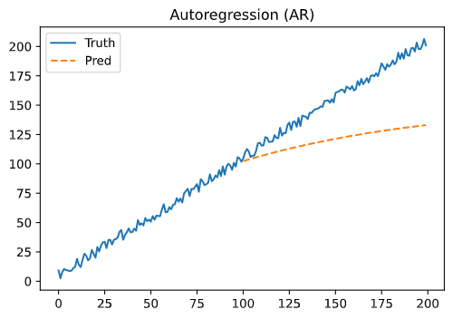
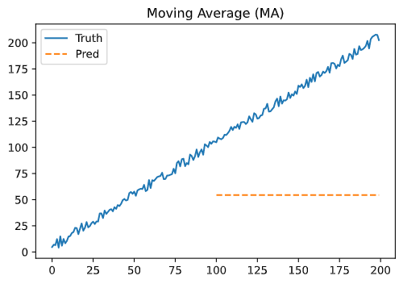
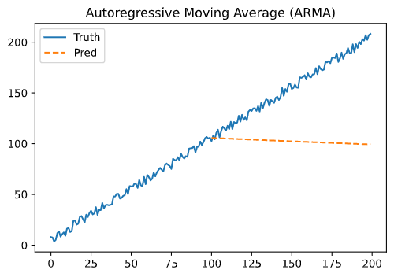
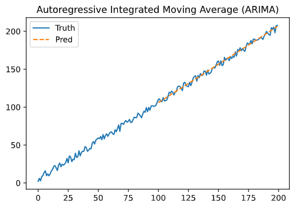

# Timeseries Models

- Based on Masa's notebook 👏 https://www.kaggle.com/sajikim/time-series-forecasting-methods-example-python
1. Autoregression, AR
2. Moving Average, MA
3. Autoregressive Moving Average, ARMA
4. Autoregressive Integrated Moving Average, ARIMA
- Example code[1]
[1]: https://github.com/da2021-jieun/datasci_exercises/blob/main/tsa/AR%2CMA%2CARIMA.py

## Autoregression, AR
- Autoregression models the next step in the sequence as a linear function of the **observations** at prior time steps.
- `AR(p)` where p is the order of the model; AR(1) is a first-order AR model
- Suitable for univariate timeseries without trend and seasonality

## Moving Average, MA
- It models the next step in the sequence as a linear function of the **residual errors** from a mean process at prior time steps.
- `MA(q)` where q is the order of the model; MA(1) is a first-order MA model
- Suitable for univariate timeseries without trend and seasonality

## Autoregressive Moving Average, ARMA
- It models the next step in the sequence as a linear function of (i) the observations and (ii) residual errors at prior time steps.
- Combines AR and MA models
- `ARMA(p,q)`
- Suitable for univariate time series without trend and seasonality

## Autoregressive Integrated Moving Average, ARIMA
- It models the next step in the sequence as a linear function of (i) the **differenced** observations and (ii) residual errors at prior time steps.
- Combines AR and MA models and adds a preprocessing step of differencing, aka integration, to make the sequence stationary
- `AR(p), I(d), MA(q)`
- Suitable for univariate time series with trend and without seasonality

